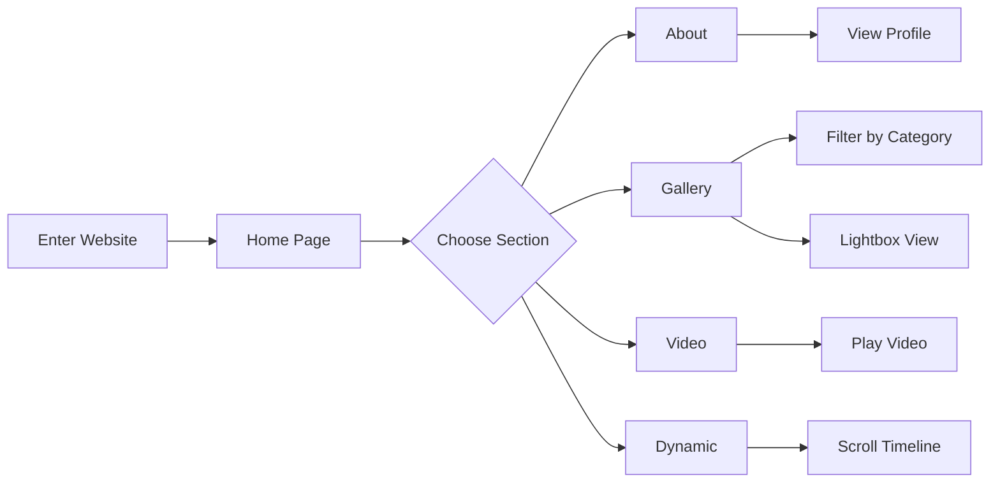

## 1. Product Overview
为博主乌苏苏打造的个人展示网站，采用绿色白色配色方案，展现她温柔而有生命力的个人魅力。网站包含个人介绍、作品展示、动态更新等核心模块，提供流畅的移动端浏览体验。

## 2. Core Features

### 2.1 User Roles
| Role | Registration Method | Core Permissions |
|------|---------------------|------------------|
| Normal User | None | Browse all content, view images and videos |
| Admin | Local authentication | Upload images, videos, manage content |

### 2.2 Feature Module
1. **Home page**: Hero banner with animated effects, quick navigation, featured works preview
2. **About page**: Personal introduction, profile, interesting facts about 乌苏苏
3. **Gallery page**: Image gallery with category filtering, lightbox view
4. **Video page**: Video showcase with embedded players, category organization
5. **Dynamic page**: Latest updates, daily sharing timeline
6. **Admin page**: Content management dashboard for uploading media

### 2.3 Page Details
| Page Name | Module Name | Feature description |
|-----------|-------------|---------------------|
| Home page | Hero section | Full-screen banner with parallax scrolling and fade-in animation |
| Home page | Navigation | Fixed top navigation with smooth scroll to sections |
| Home page | Featured works | Horizontal scrollable card preview of latest works |
| About page | Profile | Detailed personal introduction with styled timeline |
| About page | Personality | Display of her unique traits (slow speaking, gentle yet with attitude) |
| Gallery page | Category filter | Filter images by category (cosplay, daily, event) |
| Gallery page | Lightbox | Click to view full-size image with navigation |
| Video page | Video player | Embedded video with responsive sizing |
| Video page | Category tabs | Organize videos by type |
| Dynamic page | Timeline | Chronological display of updates with pagination |
| Admin page | Upload form | Drag-and-drop upload for images and videos |
| Admin page | Content list | Manage and edit uploaded content |

## 3. Core Process

### User Browsing Flow

### Admin Content Upload Flow

## 4. User Interface Design

### 4.1 Design Style
- **Primary color**: Fresh green (#22C55E) - representing vitality and natural charm
- **Secondary color**: White (#FFFFFF) - clean and pure
- **Accent color**: Dark green (#166534) - depth and elegance
- **Button style**: Rounded corners with subtle shadows, gradient hover effects
- **Font**: 'Noto Serif SC' for headings (elegant serif), 'Noto Sans SC' for body text
- **Layout**: Card-based design with generous white space
- **Animation**: Smooth transitions, fade-in effects, parallax scrolling

### 4.2 Page Design Overview
| Page Name | Module Name | UI Elements |
|-----------|-------------|-------------|
| Home page | Hero section | Full-screen background image, centered title with subtitle, animated CTA button |
| Home page | Navigation | Transparent navbar that becomes solid on scroll, logo on left, menu items on right |
| Home page | Featured works | Horizontal scroll cards with image, title, category tag, hover scale effect |
| About page | Profile | Avatar circle, name, title, short bio, stats (fans, works, likes) |
| About page | Timeline | Vertical timeline with key life events and descriptions |
| Gallery page | Category filter | Pill-shaped filter buttons with active state highlighting |
| Gallery page | Grid | Masonry grid layout for images, consistent card style |
| Video page | Video cards | Thumbnail with play button overlay, title, view count, duration |
| Dynamic page | Timeline | Date-based grouping, card with text and optional image attachment |
| Admin page | Upload form | Drop zone with dashed border, file input, form fields |

### 4.3 Responsiveness
- **Mobile-first design approach**
- Touch-optimized navigation with hamburger menu on mobile
- Responsive grid layouts that adapt to screen size
- Swipe gestures for gallery navigation
- Optimized image loading for mobile networks

### 4.4 Brand Personality Elements
- Gentle green gradient backgrounds
- Soft shadow effects
- Floral/decorative elements in corners
- Animated floating particles representing vitality
- Typography that reflects her slow, gentle speaking style
