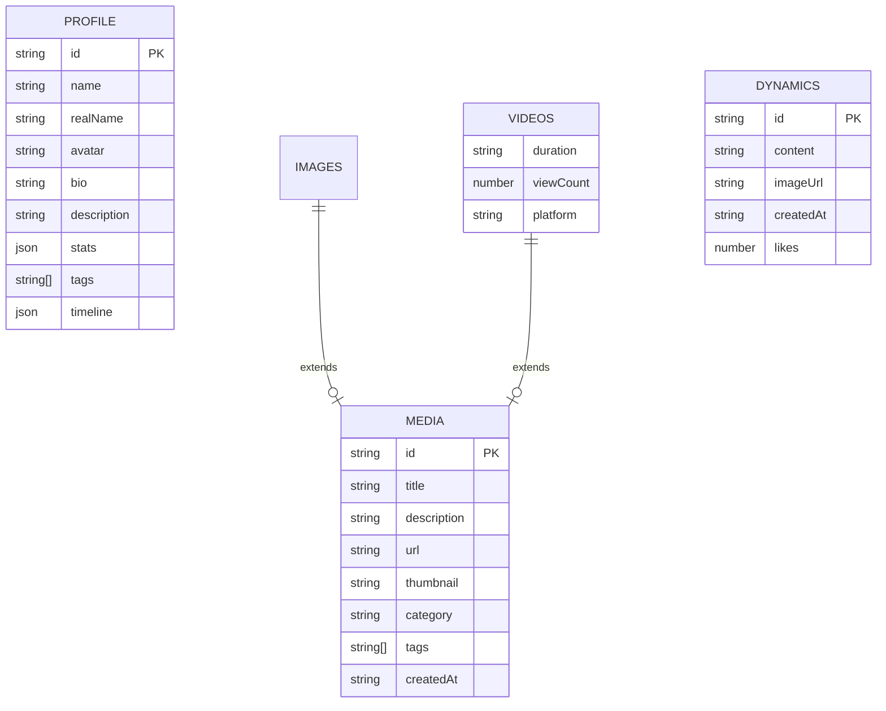

## 1. Architecture Design

```mermaid
flowchart TB
    subgraph Frontend
        A[React + TypeScript] --> B[Vite]
        B --> C[Tailwind CSS]
        C --> D[react-router-dom]
        D --> E[Zustand State]
    end
    
    subgraph Data Layer
        F[Local JSON Data] --> G[Media Files]
    end
    
    subgraph External Services
        H[Video Embeds]
        I[Cloud Storage]
    end
    
    Frontend --> Data Layer
    Frontend --> External Services
```

## 2. Technology Description
- **Frontend**: React@18 + TypeScript + Tailwind CSS@3
- **Build Tool**: Vite@6
- **Routing**: react-router-dom@6
- **State Management**: Zustand
- **Icons**: lucide-react
- **Image Gallery**: Custom implementation with lightbox
- **Video Player**: HTML5 video element with embedded YouTube/Douyin support

## 3. Route Definitions

| Route | Purpose | Component |
|-------|---------|-----------|
| `/` | Home page with hero and featured content | Home |
| `/about` | Personal introduction and profile | About |
| `/gallery` | Image gallery with categories | Gallery |
| `/videos` | Video showcase | Videos |
| `/dynamic` | Latest updates timeline | Dynamic |
| `/admin` | Content management dashboard | Admin |

## 4. API Definitions (Frontend Data)

### 4.1 Data Types

```typescript
interface MediaItem {
  id: string;
  title: string;
  description: string;
  url: string;
  thumbnail?: string;
  category: string;
  tags: string[];
  createdAt: string;
}

interface ImageItem extends MediaItem {
  width: number;
  height: number;
}

interface VideoItem extends MediaItem {
  duration: string;
  viewCount: number;
  platform: 'youtube' | 'douyin' | 'bilibili';
}

interface DynamicPost {
  id: string;
  content: string;
  imageUrl?: string;
  createdAt: string;
  likes: number;
}

interface Profile {
  name: string;
  realName: string;
  avatar: string;
  bio: string;
  description: string;
  stats: {
    fans: number;
    works: number;
    likes: number;
  };
  tags: string[];
  timeline: TimelineItem[];
}

interface TimelineItem {
  year: string;
  event: string;
  description: string;
}
```

### 4.2 Static Data Files

| File | Purpose |
|------|---------|
| `data/profile.ts` | Personal profile information |
| `data/images.ts` | Gallery image data |
| `data/videos.ts` | Video content data |
| `data/dynamics.ts` | Latest updates data |

## 5. Project Structure

```
src/
├── components/
│   ├── Header/           # Navigation component
│   ├── Footer/           # Page footer
│   ├── Hero/             # Hero banner section
│   ├── Card/             # Reusable card components
│   ├── Gallery/          # Gallery components
│   ├── VideoPlayer/      # Video player component
│   └── Timeline/         # Timeline component
├── pages/
│   ├── Home.tsx          # Home page
│   ├── About.tsx         # About page
│   ├── Gallery.tsx       # Gallery page
│   ├── Videos.tsx        # Videos page
│   ├── Dynamic.tsx       # Dynamic page
│   └── Admin.tsx         # Admin page
├── data/
│   ├── profile.ts        # Profile data
│   ├── images.ts         # Image data
│   ├── videos.ts         # Video data
│   └── dynamics.ts       # Dynamic data
├── store/
│   └── index.ts          # Zustand store
├── utils/
│   └── helpers.ts        # Utility functions
├── App.tsx               # Main app component
├── main.tsx              # Entry point
└── index.css             # Global styles
```

## 6. Data Model

### 6.1 Data Structure



### 6.2 Initial Data Content

**Profile Data:**
- Name: 乌苏苏
- Real name: 翁苏怡
- Nicknames: 乌猪猪, 乌鲁鲁, 乌呆呆
- Bio: 平安健康，开心快乐，永远钟爱中式古典美学
- Stats: 335.6万粉丝，631作品，8454.4万点赞

**Content Categories:**
- Cosplay: 王者荣耀角色、古风人物
- Daily: 日常生活、美食、穿搭
- Event: 线下活动、漫展、演出

**Video Platforms:**
- Douyin
- Bilibili
- YouTube

## 7. Performance Optimization

### 7.1 Frontend Optimization
- Image lazy loading with Intersection Observer
- Code splitting for route-based components
- CSS optimization with Tailwind JIT
- Responsive image sizing with srcset
- Caching static assets

### 7.2 Mobile Optimization
- Touch-friendly navigation
- Optimized image formats (WebP)
- Minified JavaScript bundles
- Fast initial load with preload
